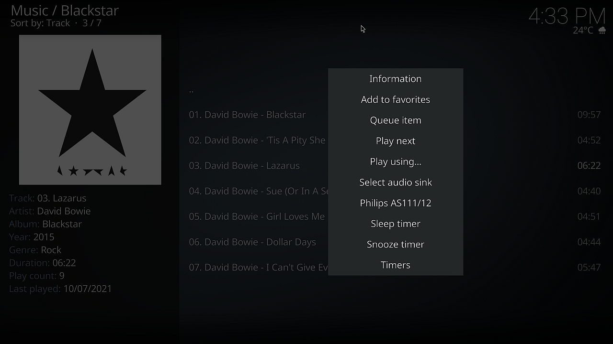

# kodi-addon-pwsink
_Kodi addon  to set Pipewire-Audio sinks with Bluetooth support_

I have written this KODI plugin to make it as easy as possible to switch between audio sinks.

This plugin is based on my project [pwsink](https://github.com/Heckie75/pwsink) 

## Requirements / pre-conditions

Internally, `pwsink` leverages the following tools:

1.  **`bluez`**: This suite provides the fundamental Bluetooth tools and daemons. Specifically, `pwsink` utilizes the `bluetoothctl` command to:
    * List already paired A2DP Bluetooth devices.
    * Connect to these devices by either their name or MAC address.

2.  **`pw-dump`**: The PipeWire state dumper, used by `pwsink`.

3.  **`wpctl`**: The PipeWire control command-line interface, also employed by `pwsink`.

## Install kodi plugin / addon

To get started, download the archive file, for example, `script.pwsink.1.0.0.zip`. You'll need to install this addon using the downloaded archive file, as it's not part of the official Kodi addon repositories.

Once the addon is installed, you'll need to explicitly enable it, and you might need to restart Kodi for the changes to take effect. Here's how:

1. Launch Kodi.
2. Navigate to the "Add-ons" menu.
3. Select "User add-ons".
4. Within "User add-ons", choose "All add-ons".
5. Locate "Pulse-Audio Sink Setter" and select it to activate.

## Howto

After you've installed and activated the plugin, you'll find a new tile in Kodi's "Add-ons" menu. This is a program add-on. Additionally, the plugin conveniently adds a "Select audio sink" option to the context menu, making it accessible with just a few clicks.

### Overview

After you have clicked on "Pipewire Sink Setter" the plugin is going to detect your audio sinks and already paired bluetooth A2DP devices. This can also be done in _addon's setttings dialog_.

**Note:** The plugin doesn't come with pairing capabilities. You must pair your bluetooth audio devices by yourself.

Afterwards you will see a list like this:

The pre-selected entry is the default sink which is the sink that is active at this moment.

### Aliases
As you have seen there are pretty names for ALSA and bluetooth devices. These _aliases_ can be configured in the settings dialogs like this:

