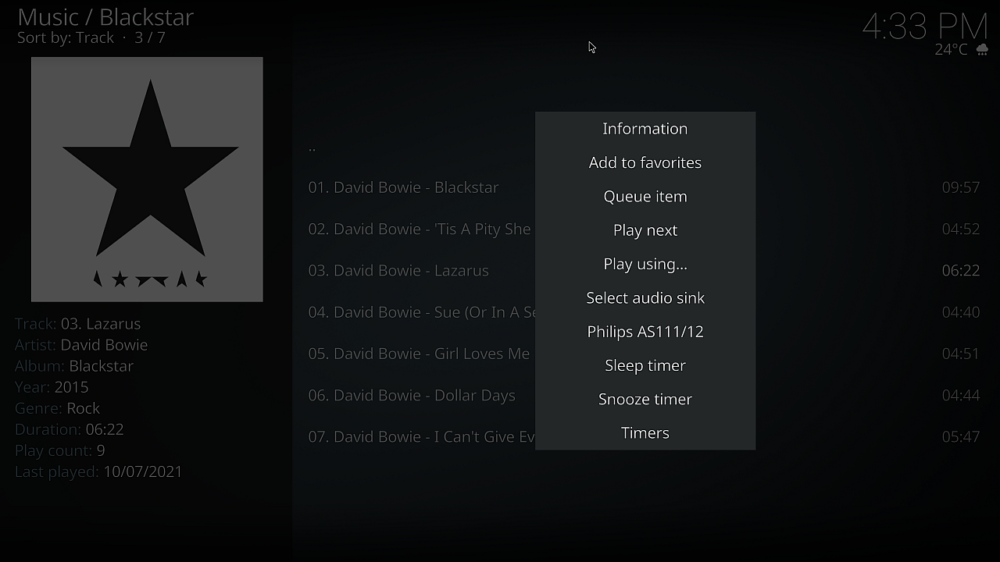

# kodi-addon-pwsink
_Kodi add-on to set PipeWire audio sinks with Bluetooth support_

This add-on makes it easy to switch between audio sinks in Kodi.

It is based on my project [pwsink](https://github.com/Heckie75/pwsink).

## Requirements / pre-conditions

Internally, `pwsink` uses the following tools:

1. **`bluez`**: This suite provides the underlying Bluetooth tools and daemons. In particular, `pwsink` uses `bluetoothctl` to:
   * list already paired A2DP Bluetooth devices
   * connect to these devices by name or MAC address

2. **`pw-dump`**: The PipeWire state dumper used by `pwsink`.

3. **`wpctl`**: The PipeWire control command-line interface also used by `pwsink`.

## Changelog

### v1.0.1 (2026-10-06)
- autoresume on sink change if Kodi was playing before and has paused

### v1.0.0 (2025-04-20)
- Initial version

## Install the Kodi add-on

Download the archive file, for example `script.pwsink.1.0.0.zip`, and install it from the zip file in Kodi. This add-on is not part of the official Kodi add-on repositories.

After installation, enable the add-on and, if needed, restart Kodi so the changes take effect.

1. Launch Kodi.
2. Open the "Add-ons" menu.
3. Select "User add-ons".
4. In "User add-ons", choose "All add-ons".
5. Locate "Pipewire Sink Setter" and select it to activate it.

## How to use it

After installation and activation, you will find a new entry in Kodi's "Add-ons" menu. This is a program add-on. The add-on also adds a "Select audio sink" entry in the context menu for quick access.

### Overview

After you click on "Pipewire Sink Setter", the add-on detects your audio sinks and already paired Bluetooth A2DP devices. This can also be done in the add-on settings dialog.

**Note:** The add-on does not include pairing functionality. You must pair your Bluetooth audio devices yourself.

You will then see a list like this:

The pre-selected entry is the current default sink, which is the sink that is active at the moment.

### Aliases

As you have seen, there are more readable names for ALSA and Bluetooth devices. These aliases can be configured in the settings dialog like this:

